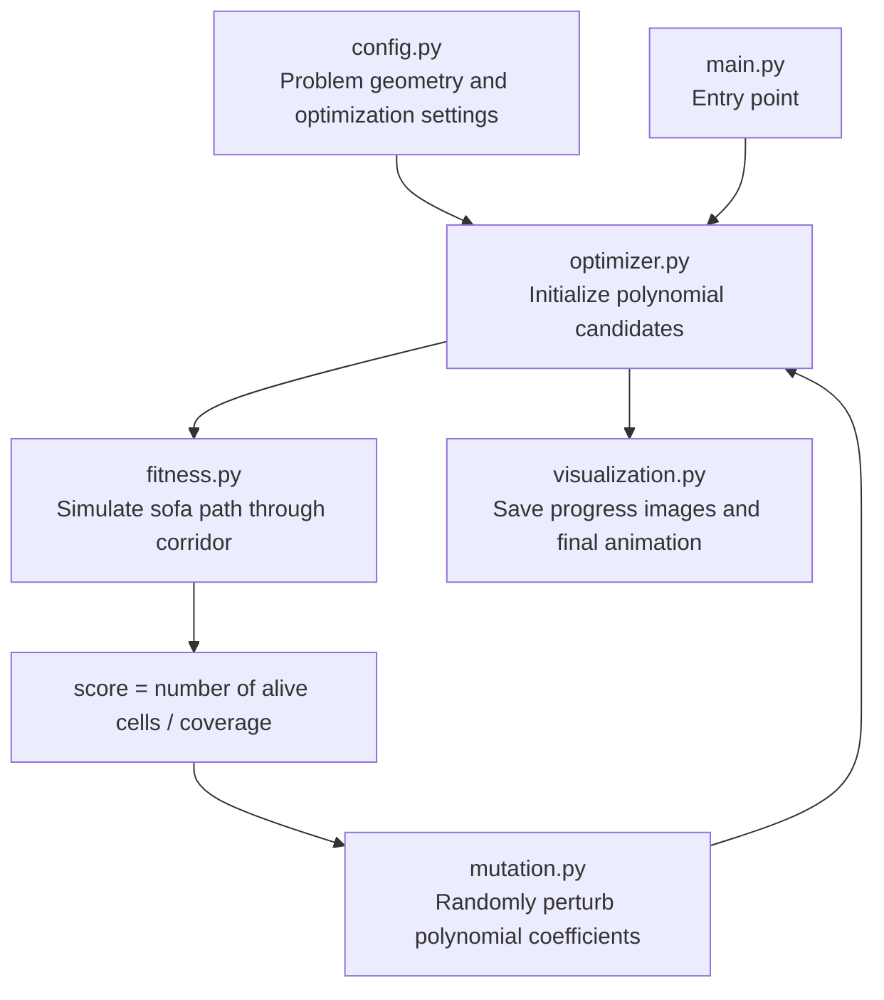

# Sofa Problem Optimizer

This project searches for a good solution to the moving sofa problem by representing the sofa's motion as a pair of polynomials and using a hill-climbing style optimizer on their coefficients.

The idea is to describe:

- the sofa center path as a polynomial function `movement(x)`, and
- the sofa orientation angle as a polynomial function `rotation(x)`,

for each x-position along the corridor. Then the code evaluates how much of the sofa stays inside the corridor over a sampled trajectory and mutates polynomial coefficients to improve the score.

---

## High-level view



At a high level, the workflow is:

1. Define the corridor geometry and the sofa size.
2. Build the initial motion and rotation polynomials.
3. Evaluate the resulting path by checking which parts of the sofa remain inside the corridor.
4. Mutate the polynomial coefficients.
5. Keep the better candidate and repeat until the solution stagnates or the run ends.
6. Save a snapshot and animation of the best result found.

---

## Problem setup

The corridor is modelled as four wall functions, defined in `config.py`:

- left upper wall
- left lower wall
- right upper wall
- right lower wall

These walls define a narrow corridor with the sofa moving from left to right along the x-axis. The sofa starts near `x = -span` and ends near `x = span`.

The script uses a discretized grid over the sofa rectangle and checks whether each occupancy cell remains inside the corridor while the sofa translates and rotates along its journey.

The optimizer tries to maximize the covered area that fits inside the corridor while keeping the sofa valid throughout the motion.

---

## Core idea: two polynomial representations

The project does not optimize the sofa as a list of discrete points. Instead, it encodes the path using polynomial coefficients.

### Movement polynomial

The center of the sofa moves along the x-axis according to a polynomial function:

- `center_x` is sampled linearly from `-span` to `span`
- `center_y = movement(center_x)`

This creates the vertical displacement of the sofa center while it moves forward.

### Rotation polynomial

The sofa's rotation angle is also modeled as a polynomial:

- `angle = rotation(center_x)`

The code fixes the endpoints of the motion so the sofa begins and ends with the correct corridor alignment, while letting the interior coefficients vary and adapt.

This is a standard hill-climbing pattern:

- mutate coefficients a little,
- evaluate the new path,
- keep the mutation if the score improves,
- repeat until the score stops improving enough.

---

## Repo structure and moving parts

### 1. `main.py`

This is the entry point.

```python
from optimizer import run

if __name__ == "__main__":
    run()
```

It simply launches the optimization routine.

---

### 2. `config.py`

This file contains the main global constants and the geometry of the problem.

Important pieces:

- `SEED`: deterministic random seed
- `span`: corridor travel range
- wall definitions using `Polynomial` objects
- `sofa_len` and `sofa_width`
- grid resolution (`res_x`, `res_y`)
- optimization parameters such as:
  - `rotation_degree`
  - `movement_degree`
  - `mutation_prob`
  - `epsilon_size`
  - `generations`
  - stagnation thresholds

This file is effectively the configuration layer for the experiment.

---

### 3. `polynomial.py`

This file defines the `Polynomial` class, which is central to the optimizer.

It implements:

- polynomial addition
- polynomial subtraction
- polynomial multiplication
- evaluation at a point `x`
- degree tracking

Example behavior:

```python
p = Polynomial([1, 2, 3])
print(p.evaluate(2))
```

The optimizer stores the motion and rotation as coefficient lists that are manipulated and evaluated repeatedly.

This class is the mathematical core of the whole project.

---

### 4. `mutation.py`

This file creates new candidate polynomials by perturbing coefficients.

`change_polynomial(poly, degree, epsilons, mutation_probability=0.2)` does the following:

- copies the current coefficients,
- pads them up to a target degree,
- selects mutable coefficients based on allowed epsilon values,
- adds a random perturbation to one or more coefficients,
- returns the new polynomial and the indices that changed.

The code uses different epsilon schedules for the rotation and movement polynomials, so different coefficients are mutated with different step sizes.

This is the local search move used by the hill climber.

---

### 5. `fitness.py`

This is the scoring function and the most important computational piece of the project.

#### High-level idea

The optimizer approximates the corridor as a grid of tiny squares. For each sampled position along the sofa's path:

- compute the center position using the movement polynomial,
- compute the sofa orientation using the rotation polynomial,
- place all grid cells of the sofa in world coordinates,
- determine whether each cell lies inside the allowed corridor region,
- mark cells that remain valid as "alive" and cells that exit the corridor as invalid.

#### Key mechanics

- `squares_position(...)` transforms local cell coordinates into world coordinates.
- `stayed_in(...)` checks whether a point remains inside the corridor walls.
- `fitness(...)` walks through the entire motion sequence and counts how many cells remain valid.

The function creates a 2D state map:

```python
state[x][y] = (is_alive, was_queued)
```

Then it does a boundary propagation / flood-like validation to identify which parts of the sofa remain inside the corridor at each step.

The returned score is the number of alive cells in the grid. In the optimizer loop this value is used as the objective function.

This is where the project turns the mathematical representation into a concrete quality score.

---

### 6. `optimizer.py`

This is the main solver loop.

#### Initialization

The script builds the starting candidates:

- `base = Polynomial([-span, 1]) * Polynomial([span, 1])`
- `mov_mult` is the evolving movement multiplier
- `rotation_base` is a fixed angular ramp
- `rot_mult` is the evolving rotation correction

The final functions are:

- `movement = base * mov_mult`
- `rotation = rotation_base + base * rot_mult`

The endpoint constraints are enforced by construction so the sofa remains anchored at the start and end of the corridor.

#### Optimization loop

The loop repeatedly does:

1. create a mutated version of the movement polynomial
2. create a mutated version of the rotation polynomial
3. evaluate the candidate using `fitness(...)`
4. accept the candidate if it improves coverage
5. if no improvement happens for too long, increase resolution and adapt mutation size

Key logic:

- `repeat_last_change` reuses a previous direction when the candidate has been improving
- `stagnation` tracks lack of improvement
- `res_x`, `res_y`, `steps`, and `epsilon_size` all increase when the search stalls

This creates a coarse-to-fine hill-climbing strategy, where the optimizer first explores a lower-resolution version of the problem and then refines it as needed.

#### Logging and outputs

Every accepted generation writes:

- a snapshot image of the sofa occupancy
- a log line in `best_solution_log.txt`

Results are stored under folders such as:

- `run_0/`
- `run_1/`
- etc.

Inside each run directory:

- `images/` contains generation snapshots
- `final_animation/` contains rendered frames of the final sofa motion

---

### 7. `visualization.py`

This file renders the current sofa state and the motion path.

#### `save_sofa_image(...)`

This creates a static occupancy image showing which cells of the sofa are alive for the current configuration.

#### `save_sofa_journey_frames(...)`

This generates animation frames by sampling the sofa along its path and plotting:

- the sofa cells in world coordinates,
- the corridor walls,
- the moving sofa at many time steps.

This is useful for inspecting whether the final trajectory is physically plausible and visually reasonable.

---

### 8. `run_0/`

The repository includes example output directories produced by a run.

These folders contain:

- generated images
- best-solution logs
- final animation frames

This acts as a visual record of the optimizer's progress and its final discovered candidate.

---

## How the optimization works in one sentence

The project defines the sofa’s movement and rotation as low-degree polynomials, mutates their coefficients with a stochastic hill-climber, evaluates how much of the sofa remains inside the corridor, and keeps the best improvements while refining the grid and search step size.

---

## Practical interpretation

This project is not a brute-force solver for the moving sofa problem. It is a search heuristic based on geometry and optimization.

Its strength is that it compresses a complex continuous motion into a relatively small set of parameters:

- a few polynomial coefficients for the path,
- a few polynomial coefficients for the rotation,
- a fitness score based on corridor occupancy.

That makes the problem search-friendly, even though the actual sofa problem is continuous and highly geometric.

---

## Summary

The project is a compact optimization prototype that:

- models a moving sofa as a parameterized trajectory,
- uses polynomial coefficients as the search variables,
- evaluates each candidate using a corridor-collision simulation,
- improves the solution with iterative mutation and acceptance,
- produces both numerical logs and visualizations of the evolving result.

If you want to inspect the behavior further, the best place to start is:

1. `config.py` for global geometry and problem constants
2. `fitness.py` for the evaluation model
3. `optimizer.py` for the actual optimization loop
4. `visualization.py` for the output renderings
