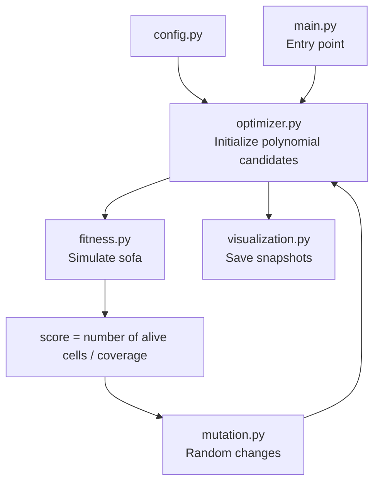

# Sofa Problem Optimizer

The sofa problem is a famous math problem about finding the largest sofa that can fit through a corner. More accurately, it is a continuous 2D shape with the greatest area that can be moved through a corridor of unit width with a right-angle bend in the middle. The problem is thought to be solved (a preprint proof exists, possibly proving the Gerver sofa to be the largest possible) with an area of approximately 2.2195. This method, with the default configuration, finds a solution with an area of 2.207, and with enough computation and parameter tuning, it could be pushed even closer to the maximum.

This project searches for a good solution to the sofa problem by representing the sofa's motion as a pair of polynomials and using a hill-climbing style optimizer on their coefficients.

The idea is to describe:

- the sofa center path as a polynomial function `movement(x)`, and
- the sofa orientation angle as a polynomial function `rotation(x)`,

for each x-position along the corridor. The code then evaluates how much of the sofa stays inside the corridor over a sampled trajectory and mutates the polynomial coefficients to improve the score.

---

## High-level view



At a high level, the workflow is:

1. Define the corridor geometry and the sofa size.
2. Build the initial motion and rotation polynomials.
3. Evaluate the resulting path by checking which parts of the sofa remain inside the corridor.
4. Mutate the polynomial coefficients.
5. Keep the better candidate and repeat until the solution stagnates or the run ends.
6. Save a snapshot and animation of the best result found.

## Problem setup
The corridor is modeled as four wall functions, defined in `config.py`.

These walls define a corridor with the sofa moving from left to right along the x-axis. The corridor is angled so the initial sofa angle is -45° and the final angle is 45°. This is to make the start and end position of the sofa be (-span, 0) and (+span, 0), which is easily enforceable since the movement is a polynomial (we simply multiply it by (x + span)(x - span)).

It is visualized well here: https://www.desmos.com/calculator/22tt7qiunr
with the 4 walls and the default center movement polynomial.

The script uses a discretized grid over the sofa rectangle and checks whether each occupancy cell remains inside the corridor while the sofa translates and rotates along its journey.

The optimizer tries to maximize the covered area that fits inside the corridor while keeping the sofa valid throughout the motion.

### Movement polynomial

The center of the sofa moves along the x-axis according to a polynomial function:

- `center_x` is sampled linearly from `-span` to `span`
- `center_y = movement(center_x)`

The `movement(center_x)` is constructed as `(x - span)(x + span)(the evolved polynomial)`, so it hits the start and end point of the path exactly. Also, the evolved polynomial is even, so the whole polynomial is even, which means the journey is symmetric; together with symmetric rotation functions, this creates a symmetric resulting sofa.

### Rotation polynomial

The sofa's rotation angle is also modeled as a polynomial:

- `angle = rotation(center_x) = (45/span * x) + (x - span)(x + span)(evolved odd polynomial)`

This design guarantees a -45° angle at the start and 45° at the end (matching the corridor). Also, because the evolved part is odd, the whole function is odd, so the sofa moves symmetrically at each end of the corridor.

### Evolution

This is a standard hill-climbing pattern:

- mutate coefficients a little,
- evaluate the new path,
- keep the mutation if the score improves,
- repeat until the score stops improving enough.

---

## Repo structure and moving parts

### 1. `main.py`

This is the entry point.

```python
from optimizer import run

if __name__ == "__main__":
    run()
```

It simply launches the optimization routine.

---

### 2. `config.py`

This file contains the main global constants and the geometry of the problem.

Important pieces:

- `SEED`: deterministic random seed
- `span`: corridor travel range
- wall definitions using `Polynomial` objects
- `sofa_len` and `sofa_width`: the dimensions of the initial rectangle that gets sculpted
- grid resolution (`res_x`, `res_y`)
- optimization parameters such as:
  - `rotation_degree`
  - `movement_degree`
  - `mutation_prob`
  - `epsilon_size`
  - `generations`
  - stagnation thresholds

This file is effectively the configuration layer for the experiment.

---

### 3. `polynomial.py`

This file defines the `Polynomial` class, which is central to the optimizer.

It implements:

- polynomial addition
- polynomial subtraction
- polynomial multiplication
- evaluation at a point `x`

---

### 4. `mutation.py`

This file creates new candidate polynomials by perturbing coefficients.

`change_polynomial(poly, degree, epsilons, mutation_probability=0.2)` does the following:

- copies the current coefficients,
- pads them up to a target degree,
- selects mutable coefficients based on allowed epsilon values (for enforcing even/odd functions),
- adds a random perturbation to one or more coefficients,
- returns the new polynomial and the indices that changed.

The epsilons define by how much the given coefficient changes; it is a uniformly sampled change from `(-epsilon, +epsilon)`. The epsilons are set as a percentage of the coefficient (or zero if we want an even polynomial), and this percentage decreases as the solutions are refined so the adjustments become finer.

---

### 5. `fitness.py`

The optimizer approximates the sofa as a grid of tiny squares. For each sampled position along the sofa's path:

- compute the center position using the movement polynomial,
- compute the sofa orientation using the rotation polynomial,
- place all grid cells of the sofa in world coordinates,
- determine whether each cell lies inside the allowed corridor region,
- mark cells that remain valid as "alive" and cells that exit the corridor as invalid.

#### Key mechanics

- `squares_position(...)` transforms local cell coordinates into world coordinates.
- `stayed_in(...)` checks whether a point remains inside the corridor walls.
- `fitness(...)` walks through the entire motion sequence and counts how many cells remain valid.

The function creates a 2D state map:

```python
state[x][y] = (is_alive, was_queued)
```

Then, at each step, only the boundary layer is checked so the inside squares are not checked every time. When a square is killed, its neighbors get queued into the boundary layer.

The returned score is the number of alive cells in the grid.

---

### 6. `optimizer.py`

This is the main solver loop.

#### Initialization

The script builds the starting candidates:

- `base = Polynomial([-span, 1]) * Polynomial([span, 1])`
- `mov_mult` is the evolving movement multiplier
- `rotation_base` is a fixed angular ramp
- `rot_mult` is the evolving rotation correction

The final functions are:

- `movement = base * mov_mult`
- `rotation = rotation_base + base * rot_mult`

#### Optimization loop

The loop repeatedly does:

1. create a mutated version of the movement polynomial
2. create a mutated version of the rotation polynomial
3. evaluate the candidate using `fitness(...)`
4. accept the candidate if it improves coverage
5. if no improvement happens for too long, increase resolution and adapt mutation size

Key logic:

- `repeat_last_change` reuses a previous direction when the candidate has been improving
- `stagnation` tracks lack of improvement
- `res_x`, `res_y`, `steps` all increase and `epsilon_size` decreases when the search stalls

This creates a coarse-to-fine hill-climbing strategy, where the optimizer first explores a lower-resolution version of the problem and then refines it as needed.

#### Logging and outputs

Every accepted generation writes:

- a snapshot image of the sofa occupancy
- a log line in `best_solution_log.txt`

Results are stored under folders such as:

- `run_0/`
- `run_1/`
- etc.

Inside each run directory:

- `images/` contains generation snapshots
- `final_animation/` contains rendered frames of the final sofa motion

---

### 7. `visualization.py`

This file renders the current sofa state and the motion path.

#### `save_sofa_image(...)`

This creates a static occupancy image showing which cells of the sofa are alive for the current configuration.

#### `save_sofa_journey_frames(...)`

This generates animation frames by sampling the sofa along its path and plotting:

- the sofa cells in world coordinates,
- the corridor walls,
- the moving sofa at many time steps.

This is useful for inspecting whether the final trajectory is physically plausible and visually reasonable.

---

### 8. `run_0/`

The repository includes example output directories produced by a run.

These folders contain:

- generated images
- best-solution logs
- final animation frames

This acts as a visual record of the optimizer's progress and its final discovered candidate.

---